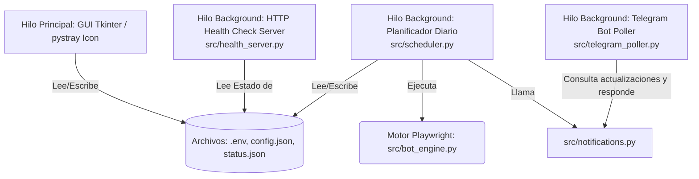

# 🤖 SiGCA Lunch Automation (SiGCABot)

¡Bienvenido a **SiGCABot**! Una solución premium, moderna y automatizada de nivel comercial para gestionar y solicitar almuerzos de forma inteligente en la plataforma corporativa SiGCA. 

El proyecto combina un potente script motor de automatización web con una elegante aplicación de escritorio de Windows para ofrecer tranquilidad diaria al empleado, garantizando que el almuerzo se pida a tiempo y enviando reportes visuales en tiempo real.

---

## 🌟 Características Principales

*   **Interfaz Gráfica Premium (Dark Mode):** Panel de control moderno basado en la paleta de colores *Hextech Client (LoL)* oscuro. Cuenta con pestañas de configuración, cuestionario, visualizador de registros (consola de logs) y panel de monitoreo con manual de uso integrado vía web.
*   **Automatización Web Inteligente (Playwright):** Automatiza el inicio de sesión del SSO (Single Sign-On) corporativo de Microsoft, navega a la sección de pedidos, selecciona el menú preferido (Saludable o Estándar), autocompleta encuestas/formularios adicionales opcionales y confirma la solicitud.
*   **Cuestionario Dinámico Configurable:** Permite definir desde la interfaz (Sede, Evaluación, Comentarios y opciones específicas del plato) las respuestas predeterminadas que el bot usará para rellenar los formularios adicionales, inyectándolas en tiempo de ejecución.
*   **Integración con el Programador de Tareas de Windows:** Registra y elimina tareas programadas directamente desde la GUI con elevación UAC automática. Configura la tarea con repetición horaria periódica (cada 1 hora durante 18 horas) para garantizar el reintento automático ante suspensiones, apagados o fallos de red. La ruta de código fuente delega en `app_gui.py --run-job`, que valida y persiste `status.json`.
*   **Control de Duplicados & Seguridad:** Inspecciona dinámicamente la página web para detectar si la solicitud ya fue registrada previamente, deteniendo la operación automáticamente para evitar duplicaciones.
*   **Bandeja del Sistema (System Tray):** Minimiza la ventana a la barra de tareas de Windows (icono de bandeja de sistema) para operar en segundo plano sin ocupar espacio.
*   **Notificaciones Windows Toast:** Alertas nativas integradas de Windows 10/11 para notificar éxitos o fallos inmediatamente en el escritorio.
*   **Mensajería Bidireccional en Telegram:** 
    *   Envía el estatus detallado del pedido al chat personal junto con la **captura de pantalla (evidencia)** del formulario procesado.
    *   Soporta comandos interactivos (ej. `/status`, `/health`) para consultar remotamente el estado del bot.
*   **Servidor Web de Monitoreo (Health Check Local):**
    *   Expone una API JSON en `http://127.0.0.1:18293/health` para telemetría.
    *   Expone un Dashboard interactivo en `http://127.0.0.1:18293/` con logs en tiempo real, estado del servicio y previsualización de la última evidencia.
*   **Control de Ejecución y Reintentos:** Usa un bloqueo entre procesos para evitar solicitudes simultáneas, reintentos configurables mediante `retries` y una espera interna configurable mediante `retry_attempt_delay_sec`. `retry_delay_sec` controla el cooldown del planificador.
*   **Compilación Automatizada:** Script `build.bat` que empaqueta todo el proyecto en un ejecutable portable listo para distribución.

---

## 🏗️ Arquitectura del Proyecto

El proyecto utiliza una arquitectura **modular por capas** dentro del paquete `src/`:

```
solicitud_almuerzo_auto/
├── app_gui.py              ← Punto de entrada principal (GUI + modo CLI)
├── lunch_bot.py            ← CLI de pruebas rápidas para desarrolladores
├── build.bat               ← Script de compilación automatizada
├── run_job.bat             ← Script para ejecución desde Task Scheduler
├── SiGCABot.spec           ← Especificación de PyInstaller
├── config.json             ← Configuración de preferencias del usuario
├── .env                    ← Credenciales (no versionado)
├── .env.template           ← Plantilla de credenciales
├── requirements.txt        ← Dependencias de Python
├── README.md               ← Este archivo
├── WINDOWS_SCHEDULER.md    ← Guía del Programador de Tareas
│
├── src/                    ← Paquete de módulos internos
│   ├── __init__.py
│   ├── config.py           ← Rutas, persistencia, paleta de colores, auto-inicio
│   ├── logger.py           ← Configuración centralizada de logging
│   ├── state.py            ← Flags de estado global entre hilos
│   ├── notifications.py    ← Windows Toast y mensajes/fotos de Telegram
│   ├── bot_engine.py       ← Clase LunchBot (automatización Playwright)
│   ├── health_server.py    ← Servidor HTTP de Health Check
│   ├── telegram_poller.py  ← Escucha de comandos de Telegram
│   └── scheduler.py        ← Planificador diario + registro de tareas Windows
│
├── logs/                   ← Archivos de registro
├── evidence/               ← Capturas de pantalla (evidencias)
├── dist/                   ← Ejecutable compilado
├── build/                  ← Archivos temporales de compilación
├── tests/                  ← Pruebas automatizadas
└── venv/                   ← Entorno virtual de Python
```

---

## 🛠️ Requisitos de Desarrollo

Si deseas ejecutar, depurar o extender el proyecto desde el código fuente, asegúrate de contar con:
*   Python 3.10 o superior instalado en el sistema.
*   Navegador web Chromium o Playwright Browsers instalados.

---

## 🚀 Instrucciones para Desarrolladores (Ejecutar como Proyecto)

### 1. Clonar e Inicializar el Entorno
Abre una terminal PowerShell en el directorio del proyecto y crea un entorno virtual de Python:
```bash
# Crear entorno virtual
python -m venv venv

# Activar el entorno virtual
.\venv\Scripts\activate
```

### 2. Instalar Dependencias
Instala los paquetes necesarios definidos en `requirements.txt`:
```bash
pip install -r requirements.txt
```

### 3. Instalar Navegadores de Playwright
Playwright requiere instalar sus propios binarios del navegador Chromium para funcionar en segundo plano:
```bash
playwright install chromium
```

### 4. Configurar el Entorno
Crea un archivo `.env` en la raíz del proyecto (puedes tomar como referencia el archivo `.env.template`) con los siguientes valores:
```ini
SIGCA_URL=https://sigca.ex-cle.com/
SIGCA_USER=tu_correo@ex-cle.com
SIGCA_PASSWORDS=tu_password_sso,password_alternativo
TELEGRAM_TOKEN=tu_telegram_bot_token
TELEGRAM_CHAT_ID=tu_telegram_chat_id
```

### 5. Ejecutar Scripts Directos
*   **Ejecutar Panel GUI (Recomendado):**
    ```bash
    python app_gui.py
    ```
*   **Ejecutar Motor de Almuerzo en Consola (Prueba en Seco/Dry-Run):**
    ```bash
    # CLI directo para pruebas de desarrollador
    python lunch_bot.py --dry-run --force-time
    ```
*   **Ejecutar en Modo CLI desde la GUI (para Task Scheduler):**
    ```bash
    python app_gui.py --run-job --dry-run --force-time
    ```

---

## 🖥️ Ejecución como Aplicación de Escritorio (.exe)

Para usuarios finales, el proyecto viene precompilado como un ejecutable portable autónomo de Windows que no requiere instalar Python ni dependencias externas.

### 1. Dónde se encuentra el Ejecutable
El archivo ejecutable compilado se encuentra en:
👉 `dist\SiGCABot_Release\SiGCABot.exe`

### 2. Cómo Configurar y Usar
1.  Haz doble clic sobre `SiGCABot.exe`.
2.  En la pestaña **Configuración**, rellena los campos requeridos:
    *   **Ajustes de Autenticación de SiGCA:** Ingresa la URL, tu correo corporativo y la contraseña de inicio de sesión de Microsoft SSO. (Puedes ingresar varias contraseñas separadas por comas si utilizas rotaciones de claves).
    *   **Configuración de Telegram:** Introduce el Bot Token y tu Chat ID. Puedes pulsar el botón **"Probar Telegram"** para verificar que el bot te mande un mensaje de prueba exitoso.
    *   **Ajustes del Sistema:** Elige tu **Menú Favorito** (*Saludable* o *Estándar*) y el rango horario en el cual planificar la revisión diaria del almuerzo.
    *   **Programador de Tareas de Windows:** Haz clic en **"📋 Registrar Tarea Diaria"** para que Windows ejecute el bot automáticamente cada día a la hora configurada, incluso si la aplicación no está abierta.
    *   **Iniciar automáticamente con Windows:** Marca esta casilla si deseas que la aplicación se inicie oculta al encender la computadora.
3.  Haz clic en **"Guardar Configuración"**.
4.  Prueba el funcionamiento de Playwright haciendo clic en **"Simular Pedido (Dry Run)"**. La app ejecutará la automatización completa sin confirmar el pedido final para verificar que tus accesos sean correctos.

### 3. Bandeja del Sistema e Interacción
*   Al cerrar la ventana (`✕`), la aplicación se minimizará a la bandeja del sistema de Windows (Icono del Robot Hamburguesa).
*   **Doble clic** en el icono de la bandeja: Restaura el Panel de Control.
*   **Clic derecho** en el icono de la bandeja:
    *   *Abrir Panel*
    *   *Ejecutar Ahora (Simulación)*: Corre una prueba manual inmediata en background.
    *   *Salir*: Cierra por completo la aplicación y apaga el servicio de automatización.

---

## 🏗️ Empaquetado y Publicación de Versiones

### 1. Compilar y Empaquetar
Para reconstruir el ejecutable autocontenido y empaquetar el paquete portable de distribución en formato ZIP, utiliza el script automatizado:

```bash
.\build.bat --package
```

Esto generará la carpeta de distribución limpia en `dist\SiGCABot_Release\` y el archivo comprimido listo para distribución en **`dist\SiGCABot_Release.zip`**.

### 2. Publicar Actualización en GitHub Releases (CLI)
Los clientes de SiGCABot se auto-actualizan en vivo consultando la API de releases. Para publicar la nueva versión compilada y adjuntar el archivo ZIP a través de comandos, ejecuta:

```bash
# Iniciar sesión en GitHub CLI si es necesario
gh auth login -p https -w

# Publicar el release con su binario
gh release create v2.4.0 dist\SiGCABot_Release.zip --title "Versión 2.4.0 - Nombre de la Versión" --notes "Notas detalladas de los cambios y correcciones."
```


---

## 📊 Arquitectura de Hilos

La aplicación utiliza un diseño multihilo asíncrono para garantizar que el panel principal nunca se bloquee ni congele durante operaciones pesadas:


