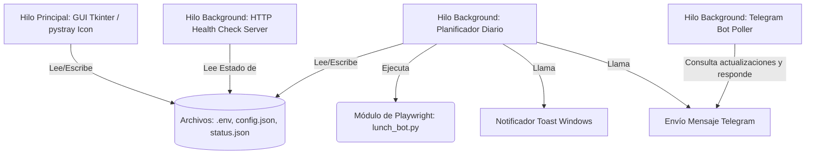

# Design: Windows Desktop Application for SiGCA Lunch Automation

**Estado:** Propuesto  
**Versión:** 1.0.0  
**Última Actualización:** 2026-06-18  

---

## 1. Arquitectura del Sistema (Diagrama de Hilos)

La aplicación utilizará una arquitectura multihilo para garantizar que la interfaz de usuario siga respondiendo, el servidor HTTP responda de inmediato, el poller de Telegram funcione sin bloqueos y el planificador ejecute los procesos pesados de Playwright de forma fluida.



---

## 2. Componentes Técnicos

### A. Interfaz Gráfica (Tkinter)
- Usaremos la biblioteca estándar `tkinter` junto con la extensión `ttk` para estilos visuales modernos.
- Implementaremos una interfaz limpia y estructurada utilizando temas de colores oscuros (`#1e1e2e` para el fondo principal, `#252538` para tarjetas/marcos, `#b4befe` para acentos).
- Un control de Toggle (interruptor) personalizado utilizando Canvas de Tkinter para representar de forma agradable el estado Activo/Inactivo.

### B. Bandeja de Sistema (`pystray`)
- `pystray.Icon` se inicializará con una imagen generada.
- Al cerrar la ventana principal de Tkinter, llamaremos a `withdraw()` de la ventana raíz en lugar de `destroy()`, lo que la mantendrá en memoria.
- Al hacer doble clic en el icono de la bandeja, se ejecutará `deiconify()` de la ventana Tkinter para volver a mostrar la ventana.

### C. Servidor HTTP de Health Check (Nativo)
- Implementación de `http.server.HTTPServer` en un puerto dedicado (`18293`).
- Rutas:
  - GET `/health`: Devuelve JSON con estado y marca de tiempo de la última ejecución.
  - GET `/`: Devuelve un dashboard HTML minimalista y estilizado con CSS embebido que muestra:
    - Estado de activación (Activo/Inactivo) con colores vivos.
    - Cuadro de logs recientes.
    - Captura de pantalla de la última evidencia cargada directamente del directorio `evidence/`.

### D. Notificaciones
- **Windows Toast:** Escribiremos un script ligero en PowerShell que invoca la API Toast de Windows y la ejecutaremos mediante `subprocess.run(["powershell.exe", ...])` para garantizar máxima compatibilidad sin dependencias binarias complejas al compilar con PyInstaller.
- **Telegram:** Solicitud HTTPS básica al bot mediante la librería estándar `urllib.request`.

### E. Diálogos y Alertas Internas (Custom Premium Dialogs)
- **Prohibición de Diálogos Nativos:** Queda prohibido el uso de ventanas de diálogo nativas del sistema (`tkinter.messagebox`) que no respeten el tema oscuro y rompan la estética premium del panel.
- **Implementación:** Se diseña la clase `PremiumMessageBox` basada en `tk.Toplevel` con un diseño modal, borderless (`overrideredirect(True)`) y un borde coloreado interactivo de `2px` que indica el tipo de alerta.
- **Paleta Temática:** Los diálogos usan el fondo `#252538` (BG_CARD) y acentos de color correspondientes al tipo:
  - **Éxito (Success):** Verde (`#a6e3a1`) y símbolo `✓`.
  - **Información (Info):** Azul (`#89b4fa`) y símbolo `ℹ`.
  - **Advertencia (Warning):** Amarillo (`#f9e2af`) y símbolo `⚠`.
  - **Error (Error):** Rojo (`#f38ba8`) y símbolo `❌`.
- **Experiencia de Usuario:** Las tarjetas incluyen la posibilidad de arrastrarse mediante drag-and-drop del header o fondo, se auto-centran con respecto a la ventana padre, y soportan las teclas `Enter` / `Esc` para cerrarse rápidamente.

---

## 3. Persistencia de Datos

Para que la aplicación persista datos y estados entre reinicios, se usarán tres archivos locales:
1. **`.env`**: Almacena variables de entorno sensibles (`SIGCA_USER`, `SIGCA_PASSWORDS`, `TELEGRAM_TOKEN`, `TELEGRAM_CHAT_ID`, `SIGCA_URL`).
2. **`config.json`**: Configuración técnica del bot (`headless`, `prefer_menu`, `timeout_ms`, etc.).
3. **`status.json`** [NUEVO]: Almacena marcas de estado de la aplicación actualizadas en tiempo real:
   ```json
   {
     "is_active": true,
     "last_successful_run": "2026-06-18",
     "last_run_timestamp": "2026-06-18 15:35:00",
     "last_run_status": "success",
     "startup_on_boot": false
   }
   ```

---

## 4. Empaquetado con PyInstaller

Para generar el ejecutable autocontenido, usaremos la siguiente línea de comandos de compilación:
```bash
pyinstaller --noconsole --onefile --name="SiGCABot" --add-data "config.json;." --add-data ".env;." app_gui.py
```
*Nota: Dado que Playwright requiere binarios de navegador Chromium, documentaremos en el manual que el ejecutable requiere que Playwright se instale o utilizaremos el paquete embebido.*
*Mejor aún: Playwright permite configurar una ruta del navegador del sistema o empaquetar los navegadores. Para que el bot sea 100% independiente, configuraremos a Playwright para que use el Chromium por defecto instalado por playwright en el sistema.*
